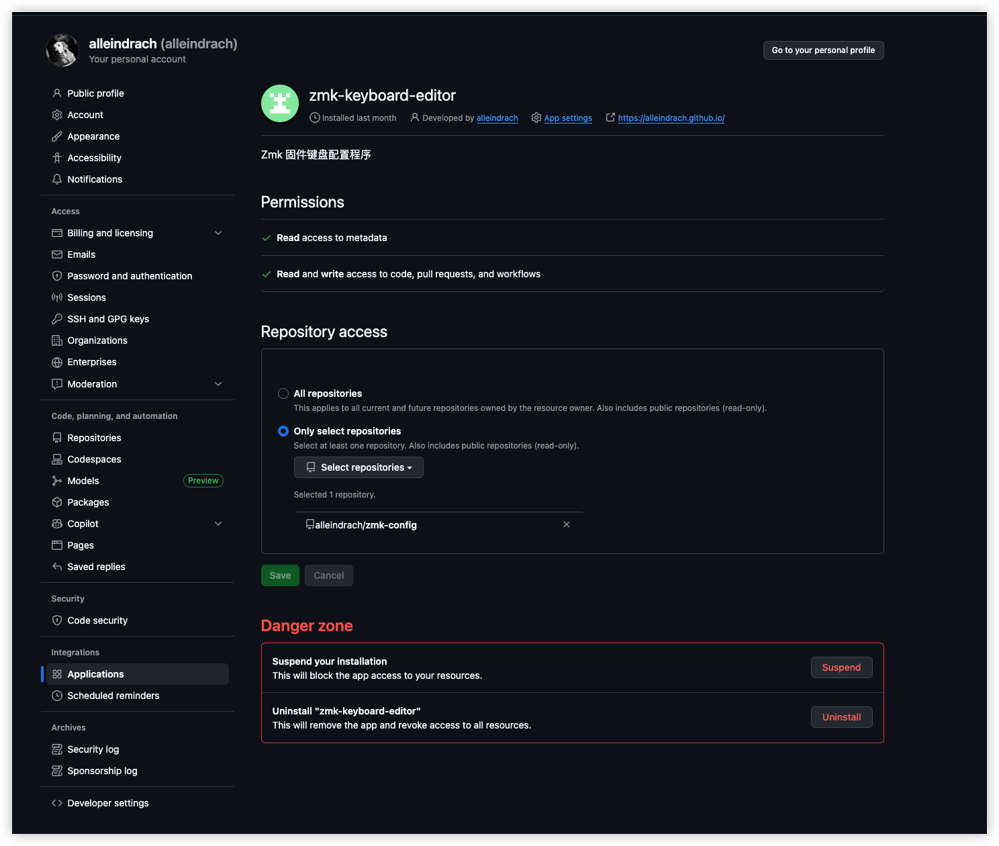
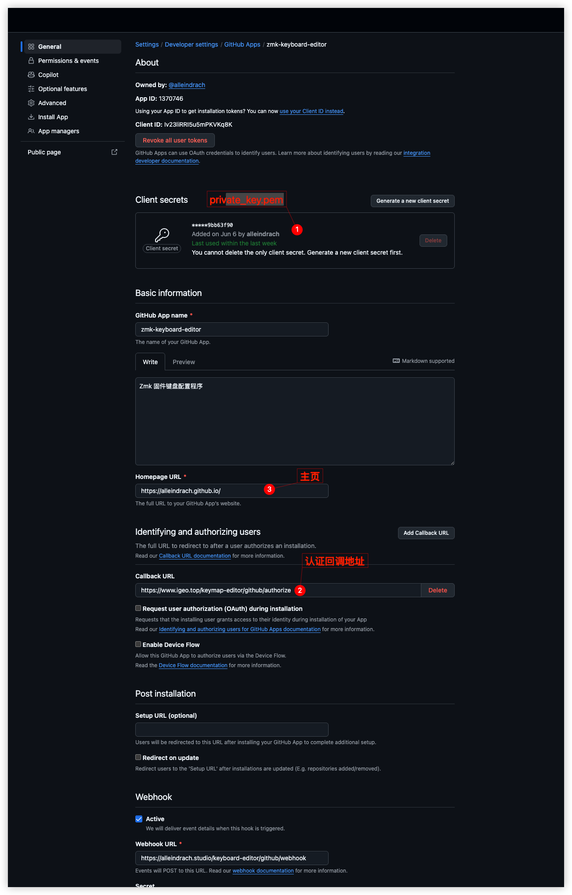

### 说明
#### app
这里是需要发布到git doc平台的前端项目，发布使用 
```
yarn deploy 
```
注意.env文件，分为开发和生产环境
开发环境：
```
PORT=3000
REACT_APP_ENABLE_LOCAL=false
REACT_APP_ENABLE_GITHUB=true
REACT_APP_GITHUB_APP_NAME=zmk-keyboard-editor
REACT_APP_API_BASE_URL=http://localhost:8080
REACT_APP_APP_BASE_URL=http://localhost:3000

```
生产环境:
```
PORT=3000
REACT_APP_ENABLE_LOCAL=false
REACT_APP_ENABLE_GITHUB=true
REACT_APP_GITHUB_APP_NAME=zmk-keyboard-editor
REACT_APP_API_BASE_URL=https://www.igeo.top/keymap-editor
REACT_APP_APP_BASE_URL=https://alleindrach.github.io/zmk-keymap-editor
```
注意，这里https://alleindrach.github.io/zmk-keymap-editor 是利用的github doc平台做的公网页面，也是最后的工程访问入口

#### api
这是后端api，用于访问zmk app 的github app.
发布到可以公开访问的地址https://www.igeo.top/keymap-editor,该服务器上nginx的配置如下：

```
        location /keymap-editor/ {
            proxy_pass http://node_1:8080/;
            proxy_http_version 1.1;
            proxy_set_header Upgrade $http_upgrade;
            proxy_set_header Connection 'upgrade';
            proxy_set_header Host $host;
            proxy_cache_bypass $http_upgrade;
            
            # CORS 配置
             # 移除后端 CORS 头
            proxy_hide_header Access-Control-Allow-Origin;  # 通配符隐藏所有 CORS 头（Nginx 1.7.3+）
            proxy_hide_header Access-Control-Allow-Methods;  # 通配符隐藏所有 CORS 头（Nginx 1.7.3+）
            proxy_hide_header Access-Control-Allow-Headers;  # 通配符隐藏所有 CORS 头（Nginx 1.7.3+）
            add_header 'Access-Control-Allow-Origin' '*' always;
            add_header 'Access-Control-Allow-Methods' 'GET, POST, OPTIONS' always;
            add_header 'Access-Control-Allow-Headers' 'Origin, X-Requested-With, Content-Type, Accept, Authorization' always;
            add_header 'Cache-Control' 'no-cache, no-store' always;
            
            # 处理 OPTIONS 预检请求
            if ($request_method = 'OPTIONS') {
                add_header 'Access-Control-Max-Age' 1728000;
                add_header 'Content-Type' 'text/plain; charset=utf-8';
                add_header 'Content-Length' 0;
                add_header 'Access-Control-Allow-Origin' '*' ;
                add_header 'Access-Control-Allow-Methods' 'GET, POST, OPTIONS';
                add_header 'Access-Control-Allow-Headers' 'Origin, X-Requested-With, Content-Type, Accept, Authorization';
                return 204;
            }
        }
```

docker_compose.yaml的内容（node_1）：
```
  node:
    restart: always
    build:
      context: ./keymap-editor
      dockerfile: Dockerfile
    container_name: "node_1"
    ports:
      - "8086:8080"
    # volumes:
    #   - /opt/igeo/keymap-editor/api:/keymap-editor/api
    networks:
      igeo_net:
        ipv4_address: 172.19.0.60
```
keymap-editor目录里的Dockerfile就是本项目下的Dockerfile,同时要拷贝private-key.pem到该目录下，目录结构如下：
```
keymap-editor/
├── api
│   ├── config.js
│   ├── index.js
│   ├── node_modules
│   ├── package.json
│   ├── private-key.pem
│   ├── routes
│   │   ├── application.js
│   │   ├── github.js
│   │   └── keyboards.js
│   ├── server.js
│   ├── services
│   │   ├── github
│   │   │   ├── api.js
│   │   │   ├── auth.js
│   │   │   ├── files.js
│   │   │   ├── index.js
│   │   │   ├── installations.js
│   │   │   └── README.md
│   │   ├── index.js
│   │   └── zmk
│   │       ├── data
│   │       │   ├── LICENSE
│   │       │   ├── zmk-behaviors.json
│   │       │   └── zmk-keycodes.json
│   │       ├── defaults.js
│   │       ├── index.js
│   │       ├── keymap.js
│   │       ├── layout.js
│   │       └── local-source.js
│   └── yarn.lock
├── Dockerfile
└── private-key.pem


```
发布的指令：
```
rsync -avr --include='.*' --exclude='.git'  --exclude-dir='node_modules' api root@www.igeo.top:/opt/igeo/keymap-editor
```
注意，要在当前项目的根目录下执行这个指令
#### github application 配置



目前这个app已经配置到了 zmk-config repo，同时，这个zmk-config也是另外一个zmk项目了




### zmk-config说明
    1. zmk-config的的结构：
```
.
├── build.yaml
├── config
│   ├── boards
│   │   └── shields
│   │       ├── allein
│   │       │   ├── allein_left.conf
│   │       │   ├── allein_left.overlay
│   │       │   ├── allein_right.conf
│   │       │   ├── allein_right.overlay
│   │       │   ├── allein.conf
│   │       │   ├── allein.dtsi
│   │       │   ├── allein.zmk.yml
│   │       │   ├── boards
│   │       │   │   ├── nice_nano_v2.overlay
│   │       │   │   └── nice_nano.overlay
│   │       │   ├── Kconfig.defconfig
│   │       │   └── Kconfig.shield
│   │       └── allein-48
│   │           ├── allein-48.conf
│   │           ├── allein-48.dtsi
│   │           ├── allein-48.keymap
│   │           ├── allein-48.keymap.template
│   │           ├── allein-48.overlay
│   │           ├── allein-48.zmk.yml
│   │           ├── boards
│   │           │   ├── nice_nano_v2.overlay
│   │           │   └── nice_nano.overlay
│   │           ├── include
│   │           │   └── mouse_tp.dtsi
│   │           ├── info.json
│   │           ├── Kconfig.defconfig
│   │           ├── Kconfig.shield
│   │           └── keymap.json
│   └── west.yml
├── package-lock.json
├── package.json
└── zephyr
    └── module.yml

```
请注意，这里除了标准的代码外，每个shield还增加了两个配置文件 info.json和keymap.json
##### info.json
这个文件给出的是按键在编辑界面的行列坐标，目的是显示键盘的配列图
```
{
    "id": "allein-48",
    "name": "allein-48",
    "layouts": {
      "LAYOUT": {
        "name": "default_transform",
        "description": "This layout matches the ZMK default transform: 1u backspace, 2u split spacebar",
        "layout": [
          {"label":    "ESC","row": 0, "col":  0, "x":     0, "y": 0 },
          {"label":    "Q", "row": 0, "col":  1, "x":     1, "y": 0 },
          {"label":    "W", "row": 0, "col":  2, "x":     2, "y": 0 },
          {"label":    "E", "row": 0, "col":  3, "x":     3, "y": 0 },
          {"label":    "R", "row": 0, "col":  4, "x":     4, "y": 0 },
          {"label":    "T", "row": 0, "col":  5, "x":     5, "y": 0 },
          {"label":    "Y", "row": 0, "col":  6, "x":     6, "y": 0 },
          {"label":    "U", "row": 0, "col":  7, "x":     7, "y": 0 },
          {"label":    "I", "row": 0, "col":  8, "x":     8, "y": 0 },
          {"label":    "O", "row": 0, "col":  9, "x":     9, "y": 0 },
          {"label":    "P", "row": 0, "col": 10, "x":    10, "y": 0 },
          {"label":    "DEL", "row": 0, "col": 11, "x":    11, "y": 0 },
  
          {"label":    "TAB", "row": 1, "col":  0, "x":     0, "y": 1 },
          {"label":    "A", "row": 1, "col":  1, "x":     1, "y": 1 },
          {"label":    "S", "row": 1, "col":  2, "x":     2, "y": 1 },
          {"label":    "D", "row": 1, "col":  3, "x":     3, "y": 1 },
          {"label":    "F", "row": 1, "col":  4, "x":     4, "y": 1 },
          {"label":    "G", "row": 1, "col":  5, "x":     5, "y": 1 },
          {"label":    "H", "row": 1, "col":  6, "x":     6, "y": 1 },
          {"label":    "J", "row": 1, "col":  7, "x":     7, "y": 1 },
          {"label":    "K", "row": 1, "col":  8, "x":     8, "y": 1 },
          {"label":    "L", "row": 1, "col":  9, "x":     9, "y": 1 },
          {"label":    ";", "row": 1, "col": 10, "x":    10, "y": 1 },
          {"label":    "Enter", "row": 1, "col": 11, "x":    11, "y": 1 },

  
          {"label":    "Shift", "row": 2, "col":  0, "x":     0, "y": 2 },
          {"label":    "Z", "row": 2, "col":  1, "x":     1, "y": 2 },
          {"label":    "X", "row": 2, "col":  2, "x":     2, "y": 2 },
          {"label":    "C", "row": 2, "col":  3, "x":     3, "y": 2 },
          {"label":    "V", "row": 2, "col":  4, "x":     4, "y": 2 },
          {"label":    "B", "row": 2, "col":  5, "x":     5, "y": 2 },
          {"label":    "N", "row": 2, "col":  6, "x":     6, "y": 2 },
          {"label":    "M", "row": 2, "col":  7, "x":     7, "y": 2 },
          {"label":    ",", "row": 2, "col":  8, "x":     8, "y": 2 },
          {"label":    ".", "row": 2, "col":  9, "x":     9, "y": 2 },
          {"label":    "Up Arrow", "row": 2, "col": 10, "x":    10, "y": 2 },
          {"label":    "Shift", "row": 2, "col": 11, "x":    11, "y": 2 },

  
          {"label":    "Fn", "row": 3, "col":  0, "x":     0, "y": 3},
          {"label":    "Ctrl", "row": 3, "col":  1, "x":     1, "y": 3},
          {"label":    "Alt", "row": 3, "col":  2, "x":     2, "y": 3},
          {"label":    "Cmd", "row": 3, "col":  3, "x":     3, "y": 3},
          {"label":    "Space", "row": 3, "col":  4, "x":     4, "y": 3},
          {"label":    "Space", "row": 3, "col":  5, "x":     5, "y": 3},
          {"label":    "Space", "row": 3, "col":  6, "x":     6, "y": 3},
          {"label":    "Space", "row": 3, "col":  7, "x":     7, "y": 3},
          {"label":    "Slash", "row": 3, "col":  8, "x":     8, "y": 3},
          {"label":    "Left Arrow", "row": 3, "col":  9, "x":     9, "y": 3},
          {"label":    "Down Arrow", "row": 3, "col":  10, "x":     10, "y":3 },
          {"label":    "Right Arrow", "row": 3, "col":  11, "x":     11, "y":3 }
        ]
      }
    },
    "sensors": []
  }
```

##### keymap.json

这个文件对应shield的keymap文件，用于将其翻译成前端可以理解的配置，对应到

```
{
  "keyboard": "allein-48",
  "keymap": "",
  "layout": "",
  "layer_names": [
    "default",
    "control"
  ],
  "layers": [
    [
        "&kp GRAVE",      "&kp Q",            "&kp W",            "&kp E",            "&kp R",      "&kp T",        "&kp Y",          "&kp U",          "&kp I",            "&kp O",          "&kp P",          "&kp BACKSPACE",
        "&ht CAPS TAB",   "&kp A",            "&kp S",            "&kp D",            "&kp F",      "&kp G",        "&kp H",          "&kp J",          "&kp K",            "&kp L",          "&kp SEMI",       "&kp ENTER",
        "&kp LSHIFT",     "&kp Z",            "&kp X",            "&kp C",            "&kp V",      "&kp B",        "&kp N",          "&kp M",          "&kp COMMA",        "&kp DOT",        "&kp UP_ARROW",   "&kp RSHIFT",
        "&mo 1",          "&kp LEFT_CONTROL", "&kp LEFT_ALT",     "&kp LEFT_COMMAND", "&kp SPACE",  "&kp SPACE",    "&kp SPACE",      "&kp SPACE",      "&kp SLASH",        "&kp LEFT_ARROW", "&kp DOWN_ARROW", "&kp RIGHT_ARROW"
    ], 
    [
       "&kp ESC",   "&kp N1",       "&kp N2",       "&kp N3",       "&kp N4",         "&kp N5",                 "&kp N6",             "&kp N7",             "&kp N8",           "&kp N9",                "&kp N0",            "&trans",
        "&trans",   "&trans",       "&trans",       "&ht_boot 0 D", "&ht_reset 0 F",  "&trans",                 "&kp LEFT_BRACKET",   "&kp RIGHT_BRACKET",  "&kp BACKSLASH",    "&kp SINGLE_QUOTE",      "&trans",            "&trans",
        "&trans",   "&ht_bt1 0 Z",  "&ht_bt2 0 X",  "&ht_bt2 0 C",  "&ht_bt_clr 0 V", "&ht_bt_clr_all 0 B",     "&kp MINUS",          "&kp EQUAL",          "&kp COMMA",        "&trans",                 "&kp PAGE_UP",      "&kp K_MUTE",
        "&trans",   "&trans",       "&trans",       "&trans",       "&trans",         "&trans",                 "&trans",             "&trans",             "&trans",           "&kp LEFT_ARROW",         "&kp DOWN_ARROW",   "&kp RIGHT_ARROW"
    ]
  ]
}
```